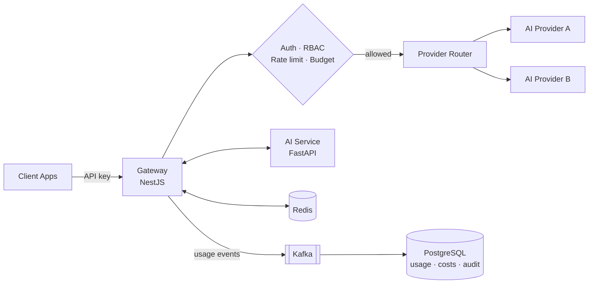

<h1 align="center">Al Shahariar Arafat Shawon</h1>

  <b>Backend Engineer · Multi-Tenant SaaS · AI Infrastructure</b> 
  TypeScript · Node.js · NestJS · PostgreSQL · Redis · Kafka · Docker

  
  
  
  

<i>📍 Dhaka, Bangladesh · 🌍 Open to remote backend roles with international teams</i>

---

## About Me

I build the server side of SaaS products: APIs, access control, data models, and the infrastructure that keeps multi-tenant systems **isolated, auditable, and cost-controlled**.

- 💼 **Backend Developer & Technical Instructor** at **Rise Together BD** (remote), building production services with NestJS, PostgreSQL, Redis, and Docker
- 🧠 Building **Tollbooth AI**, a multi-tenant LLM gateway that governs how applications access AI providers
- 🎓 B.Sc. in Computer Science & Engineering at **IUBAT** (expected 2028)
- 🧩 Competitive programmer on **Codeforces** and **LeetCode**
- 🎙️ Teach backend engineering in plain language on **[Learn With Shahariar](https://www.youtube.com/@learnwithshahariar)**

---

## Featured Projects

### 🛡️ Tollbooth AI — Multi-Tenant LLM Gateway & AI Governance Platform
<!-- Replace TOLLBOOTH_REPO_URL and TOLLBOOTH_LIVE_URL with real links, or delete them -->
[Repository](TOLLBOOTH_REPO_URL) · [Live Demo](TOLLBOOTH_LIVE_URL)

A gateway that sits between applications and AI providers to control **access, cost, and reliability** of AI usage.

- Per-tenant **API key management, RBAC, and rate limiting** on every request
- **Budget enforcement** applied *before* a request reaches a model, with token and cost tracking per tenant
- **Provider routing** across AI providers through a single gateway
- **Event-driven usage processing**: usage events flow through Kafka into PostgreSQL for analytics and audit logging

`NestJS` `TypeScript` `FastAPI` `PostgreSQL` `Prisma` `Redis` `Kafka` `pgVector` `Docker`

---

### 🧾 Rise Together — Recruitment Automation Platform
<!-- Replace RECRUITMENT_LIVE_URL with a real link, or delete it -->
[Live](RECRUITMENT_LIVE_URL)

A recruitment workflow platform built for Rise Together BD, covering the hiring lifecycle from job publishing to the final decision.

- **Stage-driven pipeline**: resume processing, eligibility checks, and candidate scoring advance applicants automatically
- Project submission and evaluation, interview scheduling, and hiring decisions in one workflow
- Automated **email notifications and status updates** at every stage
- Containerized deployment on a Linux VPS

`NestJS` `TypeScript` `PostgreSQL` `Redis` `Docker` `Linux VPS`

---

### 🛒 SureSale — Multi-Vendor Marketplace Platform
<!-- Replace SURESALE_REPO_URL and SURESALE_LIVE_URL with real links, or delete them -->
[Repository](SURESALE_REPO_URL) · [Live](SURESALE_LIVE_URL)

Led backend development for a marketplace where vendors, buyers, and admins share one platform under separate role permissions.

- **Multi-role RBAC**, vendor onboarding, and product management
- Tiered **subscription system** for vendors
- Real-time **messaging and notifications**
- Redis caching for high-read paths and Dockerized deployment

`Node.js` `Express.js` `TypeScript` `PostgreSQL` `Redis` `Docker`

---

## Tech Stack

**Backend** 

**Data & Messaging** 

**AI Engineering** 

**DevOps & Tooling** 

Also comfortable with: React, Next.js, Tailwind CSS · C++ for competitive programming

---

## How I Approach Backend Work

- **Design for tenants from day one.** Isolation, per-tenant limits, and attribution are much harder to add later.
- **Keep the request path lean.** Metering, analytics, and notifications belong in events, not in the user's wait time.
- **Make systems auditable.** If money or access is involved, every decision should leave a record.
- **Ship it, don't just build it.** Docker, Linux, and CI/CD are part of the job, not someone else's problem.

---

## Achievements

- 🚀 **NASA Space Apps Challenge 2026** — Participant
- 🛠️ **The Infinity AI BuildFest 2026** — Participant
- 🏁 **3× Software Hackathon** Participant
- 🧩 **Competitive Programming** — Codeforces & LeetCode

---

## Currently Exploring

Distributed systems design · Observability for event-driven services · Go for high-performance backend services

---

## Let's Connect

I'm open to **remote Backend Engineer roles** with international teams, especially in SaaS, platform, and AI infrastructure. 
The fastest way to reach me is **[shahariarshawon.dev@gmail.com](mailto:shahariarshawon.dev@gmail.com)** or **[LinkedIn](https://www.linkedin.com/in/alshahariar-dev)**.

  
  
  

<!-- Optional: one stats card. The public instance is sometimes rate-limited; remove it if it shows an error.

-->

> *Build deeply. Learn publicly. Teach simply.*
